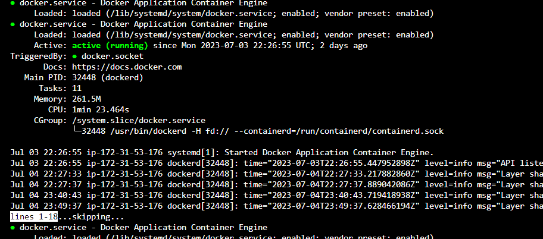
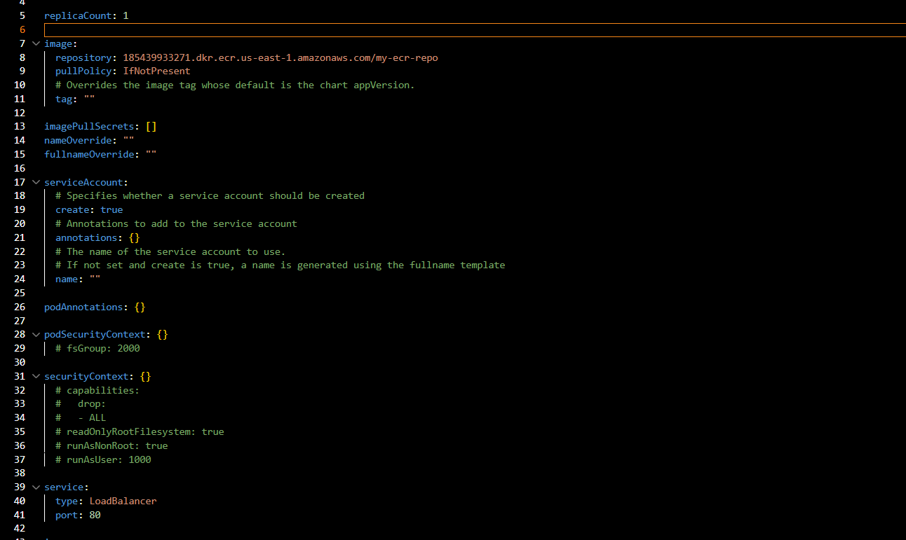

Deploy a springboot Java Application into an EKS (Elastic Kubernetes Service) cluster using Helm and a Jenkins Pipeline 

1. Push code into Version Control System (Github) - Application code, Jenkinsfile,Dockerfile and Helm Chart
2. Pushing to Github triggers Jenkins pipeline
3. Jenkins checks out the code from Github
4. Maven builds JAR file
5. Build Docker Image with dockerfile
6. Tag and push Docker Image to ECR
7. Deploy to EKS using Helm


Pre-requisites

1. EKS Cluster - Use eksctl to create cluster with 2 worker nodes

2. ECR Repository - Create one on AWS

3. Launch EC2 to act as our Jenkins server
- Install the following on our Jenkins server
   a. AWSCLI
   b. Helm
   c. Kubectl
   d. Docker
   e. eksctl
   f. Jenkins
   g. Maven


IMPLEMENTATION STEPS ARE AS FOLLOWS
- Create Github repo and constantly push our code from VSCode to Github repo (Application code, Jenkinsfile,Dockerfile and Helm Chart)
- Create Jenkins Server (EC2) and install all the necessary tools and applications as above
- Create an EKS cluster with 2 worker nodes in AWS using eksctl
- Create an ECR repository to host our docker image
- Create a Helm chart for our springboot application
- Update Helm chart to pull docker image in ECR
- Create kubeconfig credentials in Jenkins to interact with EKS cluster 
- Create Jenkins pipeline script for jenkinsfile
- Configure Jenkins to use Jenkinsfile from SCM
- Create Namespace for Helm deployment
- Deploy application into namespace in EKS
- Access application in browser using LoadBalancer url


CREATE JENKINS SERVER

Launch EC2

Name: Jenkins Server

AMI: Ubuntu 22.04 LTS

INSTANCE TYPE: t2.Large  (This isn't on the free tier and will cost you. We need enough RAM and CPU to install the pre-requisites) 


INSTALLATIONS ON EC2

INSTALL AWSCLI

```
curl "https://awscli.amazonaws.com/awscli-exe-linux-x86_64.zip" -o "awscliv2.zip" 

sudo apt install unzip

sudo unzip awscliv2.zip  

sudo ./aws/install

aws --version
```


INSTALL HELM
```
sudo apt update

curl -fsSL -o get_helm.sh https://raw.githubusercontent.com/helm/helm/master/scripts/get-helm-3

chmod +x get_helm.sh

sudo ./get_helm.sh
```
Check helm version

```
helm version
```


INSTALL KUBECTL

```
curl -s https://packages.cloud.google.com/apt/doc/apt-key.gpg | sudo apt-key add -

sudo touch /etc/apt/sources.list.d/kubernetes.list

echo "deb http://apt.kubernetes.io/ kubernetes-xenial main" | sudo tee -a /etc/apt/sources.list.d/kubernetes.list

sudo apt-get update

sudo apt-get install -y kubectl
```

VERIFY INSTALLATION

```
kubectl version --short --client
```


INSTALL EKSCTL

```
curl --silent --location "https://github.com/weaveworks/eksctl/releases/latest/download/eksctl_$(uname -s)_amd64.tar.gz" | tar xz -C /tmp
```
Move the extracted binary to /usr/local/bin. 
```
sudo mv /tmp/eksctl /usr/local/bin
```
VERIFY INSTALLATION
```
eksctl version
```


INSTALL DOCKER

Update local packages 
```
sudo apt update
```
```
Install the below packages```
sudo apt install gnupg2 pass -y
```
 
Install docker
```
sudo apt install docker.io -y
```

Add Ubuntu user to Docker group
```
sudo usermod -aG docker $USER
```
We need to reload shell in order to have new group settings applied. 
```
newgrp docker
```
The Docker service needs to be setup to run at startup. 
```
sudo systemctl start docker
sudo systemctl enable docker
```

Check the installation
```
sudo systemctl status docker
```


INSTALL JENKINS
```
wget -q -O - https://pkg.jenkins.io/debian-stable/jenkins.io.key |sudo gpg --dearmor -o /usr/share/keyrings/jenkins.gpg

sudo sh -c 'echo deb [signed-by=/usr/share/keyrings/jenkins.gpg] http://pkg.jenkins.io/debian-stable binary/ > /etc/apt/sources.list.d/jenkins.list'

sudo apt update

sudo apt install jenkins

sudo systemctl start jenkins.service
```

Check if Jenkins in running
```
sudo systemctl status jenkins
```


INSTALL DOCKER AND DOCKER PIPELINE PLUGIN AND ADD JENKINS USER TO DOCKER GROUP

```

Now Login to Jenkins > manage Jenkins > Available plugins and install
- Docker plugin
- Docker Pipeline plugin


Add jenkins user to Docker group
```
sudo usermod -a -G docker jenkins
```
Restart Jenkins service
```
sudo service jenkins restart
```
Reload system daemon files
```
sudo systemctl daemon-reload
```

Restart Docker service 
```
sudo service docker stop
sudo service docker start
```
Check the Docker status
```
sudo systemctl status docker
```


CREATE HELM CHART

Go to the root of your springboot application. 
Create helm chart by executing the commands below
```
helm create mychart
```
```
tree mychart
```

Add Docker image details to download from ECR before deploying to EKS cluster
open mychart/values.yaml.

```
# Default values for mychart.
# This is a YAML-formatted file.
# Declare variables to be passed into your templates.

replicaCount: 1

image:
  repository: 185439933271.dkr.ecr.us-east-1.amazonaws.com/my-ecr-repo
  pullPolicy: IfNotPresent
  # Overrides the image tag whose default is the chart appVersion.
  tag: ""

imagePullSecrets: []
nameOverride: ""
fullnameOverride: ""

serviceAccount:
  # Specifies whether a service account should be created
  create: true
  # Annotations to add to the service account
  annotations: {}
  # The name of the service account to use.
  # If not set and create is true, a name is generated using the fullname template
  name: ""

podAnnotations: {}

podSecurityContext: {}
  # fsGroup: 2000

securityContext: {}
  # capabilities:
  #   drop:
  #   - ALL
  # readOnlyRootFilesystem: true
  # runAsNonRoot: true
  # runAsUser: 1000

service:
  type: LoadBalancer
  port: 80

ingress:
  enabled: false
  className: ""
  annotations: {}
    # kubernetes.io/ingress.class: nginx
    # kubernetes.io/tls-acme: "true"
  hosts:
    - host: chart-example.local
      paths:
        - path: /
          pathType: ImplementationSpecific
  tls: []
  #  - secretName: chart-example-tls
  #    hosts:
  #      - chart-example.local

resources: {}
  # We usually recommend not to specify default resources and to leave this as a conscious
  # choice for the user. This also increases chances charts run on environments with little
  # resources, such as Minikube. If you do want to specify resources, uncomment the following
  # lines, adjust them as necessary, and remove the curly braces after 'resources:'.
  # limits:
  #   cpu: 100m
  #   memory: 128Mi
  # requests:
  #   cpu: 100m
  #   memory: 128Mi

autoscaling:
  enabled: false
  minReplicas: 1
  maxReplicas: 100
  targetCPUUtilizationPercentage: 80
  # targetMemoryUtilizationPercentage: 80

nodeSelector: {}

tolerations: []

affinity: {}


```

Add Docker image details to download image from ECR before deploying to EKS cluster
open mychart/values.yaml.



Enter the service type as LoadBalancer


Next, open templates/deployment.yaml
and update containerPort to 8080


Save the files and push to our Github repo


